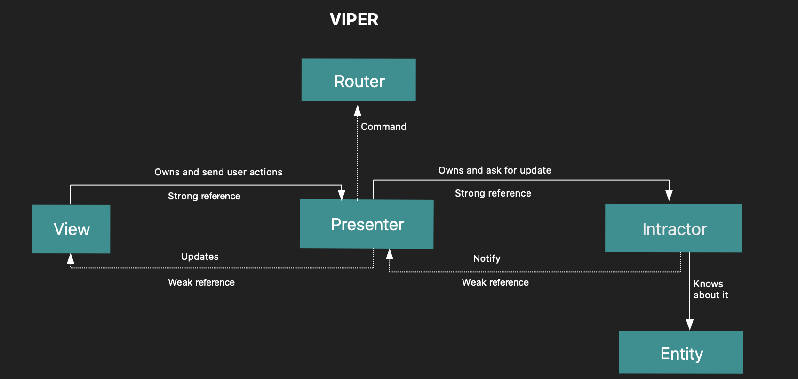

# TO -DO : Work in progress!!!!

# ViperSample
ViperSample app uses *VIPER* architecture


# VIPER 
 View-Intractor-Presenter-Entity-Router
 
 
 
 ### View
 — Responsibility of view is to send user actions to the presenter and show whatever the presenter asks it to.
 
 ### Interactor 
 — It has the business logic for the app specified by a use case.
 
 ### Presenter 
 — Contains the view logic for preparing content for display and for reacting to user interactions.
 
 ### Entity 
 — The Basic model for objects used by interaction.
 
 ### Router 
 — Contains logic for routing of screens.


## Communication:

### View — Presenter
View communicates with the Presenter regarding all the user interactions and asks the presenter to perform necessary handlings regarding the same.

### Presenter — Interactor
Presenter communicates with Interactor(The brain of the module) regarding user actions or data fetching actions.

### Interactor — Presenter
Interactor communicates with the presenter regarding the output of the business logic which has performed the necessary actions.

### Presenter — View
Presenter communicates with the view to make the necessary UI changes with the results from the Interactor.

### Presenter — Router
Presenter communicates to the router regarding navigation between pages.

# ViperSample App Flow
* Once you open the app in ```viewDidLoad``` of  ```UserListViewController```  ask the router to initialize all the out protocols starting from the one present in View till intractor, then notify presnter to download user list.
* Then presenter call intractor to fetch all the users.
* The intractor handle data fetching machanism, it can be anything like making the network request, database fetching operations etc.
* The intractor after fetching user list then notify presnter.
* The presenter then then inform the view of completion of user list data
* Then view handles displaying of the user list data


